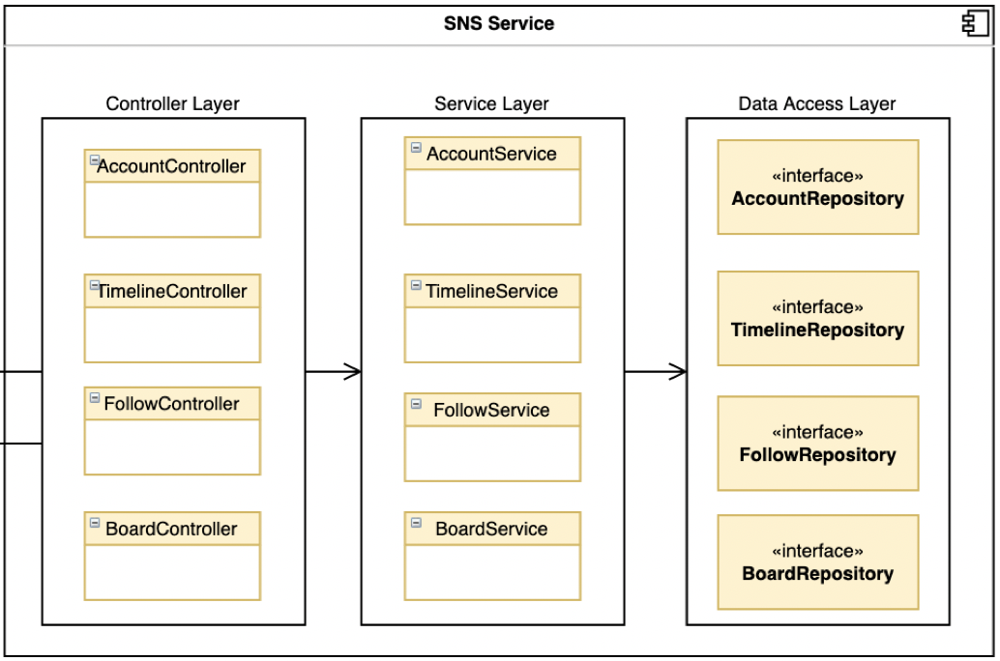

## SNS 타임라인 구현  (2020 Naver Hackday)

####  1) 배포 다이어그램

 

####  2) 클래스 다이어그램

####  3) 기술 스택

- Java 11
- Spring boot 2
- Spring Data JPA
- RDBMS (MySQL)
- Rabbit MQ
- Maven
- NBP (Naver Business Platform)

 

####  4) REST API Document

- [SNS Service REST API Guide](https://hongchan2.github.io/sns-api-docs/)

 

####  5) 개발 기간

2020.5.6 ~ 5.22

 